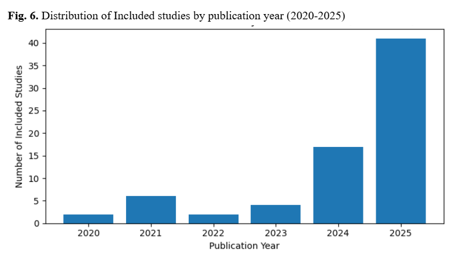
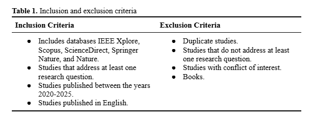
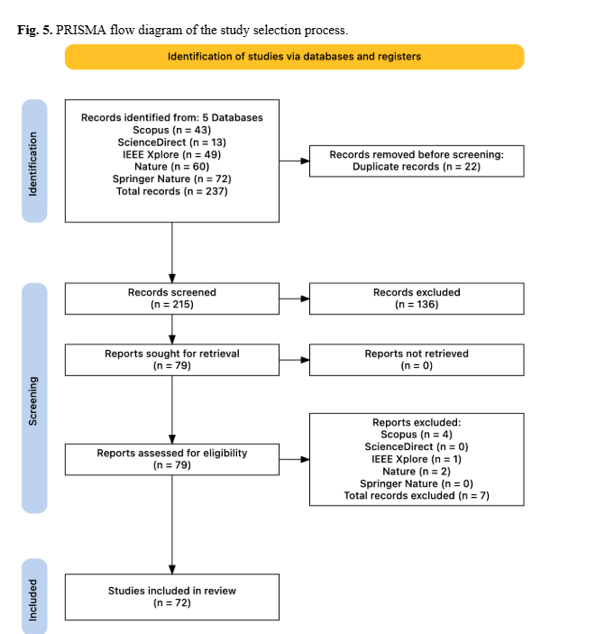

# Deep-Learning-based-Energy-Aware-Blockchain-Consensus-Mechanisms
A literature survey search in multiple databases between 2015-2026 about deep learning and energy efficient consensus mechanisms

# Introduction
This study conducts a systematic literature review (SLR) following the PRISMA methodology, analyzing 72 peer-reviewed studies selected from major scientific databases. The objective is to synthesize existing research on energy-efficient deep learning–based consensus mechanisms, identify dominant design paradigms, and highlight open challenges. 

# Abstract
Blockchain is a distributed ledger technology that guarantees data security, transparency, and immutability and its adoption is expanding rapidly in a variety of fields.Consensus mechanisms are essential for ensuring network consistency, yet traditional algorithms often require massive computational power, resulting in significant energy overhead. In recent years deep learning based consensus mechanisms are used for optimizing validator selection, dynamically tuning protocol parameters, and predicting network conditions to maximize system throughput while minimizing computational and communication-related energy overhead. This work analyzes the contributions of various research studies that address the energy efficiency of consensus mechanisms which deploy a deep learning model for decision-making. The study is a systematic literature review (SLR) in which the PRISMA methodology was applied. Seventy two studies were included in the research through searches in databases such as Scopus, Science Direct, IEEE Xplore, Springer Nature, and Nature. The  results show that deep learning within blockchain consensus mechanisms is an emerging research frontier aimed at "green" decentralized architectures.

## In our literature there are included studies which published between 2020-2025.

  

## there are some inclusion and exclusion criterias that we consider in our study.

  

## 📸 PRISMA diagram of the general review.

  

